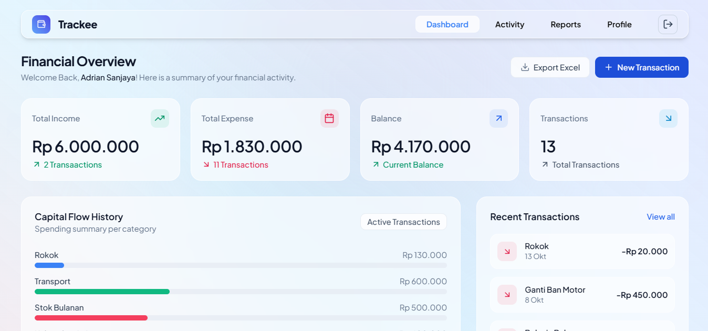
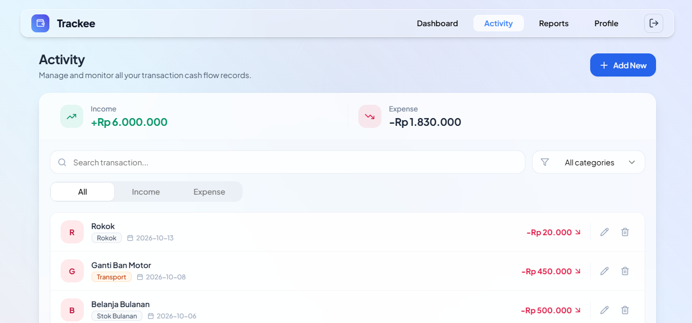
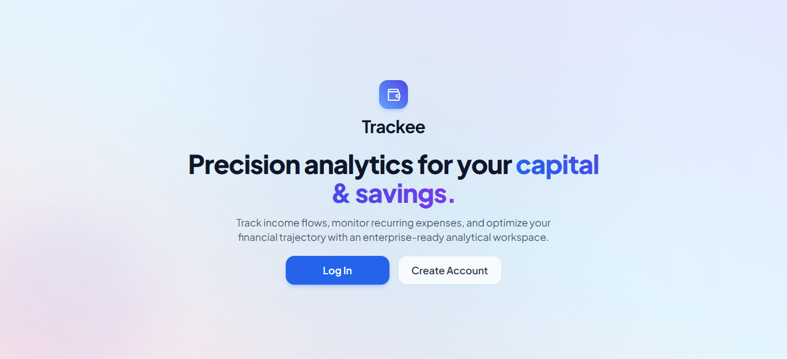
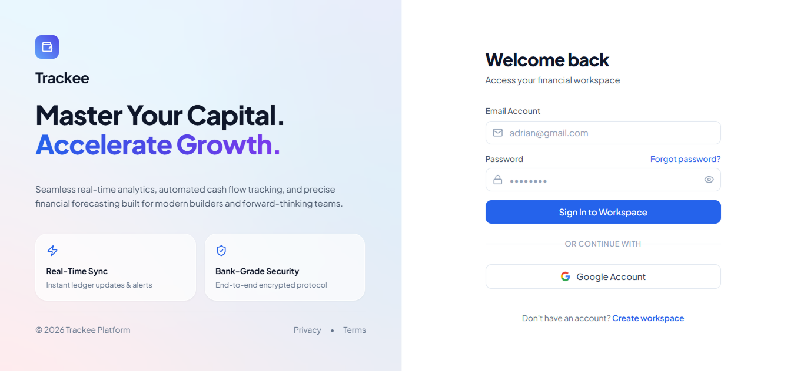
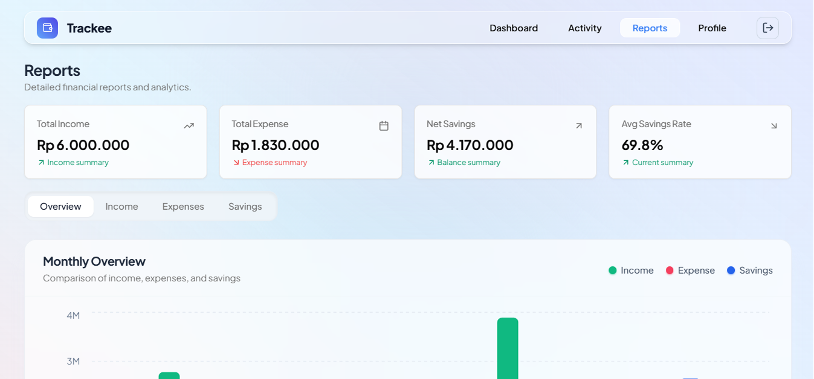

# 💰 Trackee


Precision analytics for your **capital & savings**. Track income flows, monitor recurring expenses, and optimize your financial trajectory with an enterprise-ready analytical workspace.

## 🌐 Live Demo

🔗 [https://trackee-app.vercel.app/](https://trackee-app.vercel.app/)

---

## ✨ Key Features

- 🔐 **Secure Authentication**: Multi-device auth powered by Supabase.
- 📊 **Financial Overview**: Real-time capital monitoring with active notes & balance indicators.
- 💸 **Capital Flow & Expense Analytics**: Modern category-based expense breakdown and interactive analytics.
- 💵 **Income & Outflow Tracking**: Comprehensive history of active capital movements.
- 📈 **Interactive Charts**: Donut charts, balance trends, and comparison analytics built with Recharts.
- 🗂️ **Category Management**: Tailor categories with dynamic colors and icons.
- 📱 **Glassmorphism UI**: Beautiful, fully responsive UI built with Tailwind CSS & Lucide Icons.

---

## 📸 Application Preview

<p align="center">
  
</p>

<br>

| Dashboard | Activity |
|:-----------:|:--------:|
|  |  |

| Onboarding | Login |
|:--------:|:--------:|
|  |  |

| Report | Profile |
|:------:|:--------:|
|  |  |

---

## 🛠️️ Tech Stack

### Frontend & UI
- **Framework**: [Next.js](https://nextjs.org/) (App Router, React)
- **Language**: [TypeScript](https://www.typescriptlang.org/)
- **Styling**: [Tailwind CSS](https://tailwindcss.com/)
- **Components & Icons**: [shadcn/ui](https://ui.shadcn.com/), [Lucide React](https://lucide.dev/)
- **Data Visualization**: [Recharts](https://recharts.org/)

### Backend & Database
- **Backend as a Service**: [Supabase](https://supabase.com/) (Auth, PostgreSQL Database, Row Level Security)

### Deployment
- **Platform**: [Vercel](https://vercel.com/)

---

## 📂 Project Structure

```text
trackee/
│
├── app/                  # Next.js App Router pages and API routes
├── components/           # Reusable UI components & analytics charts
├── docs/                 # Documentation and screenshots
├── hooks/                # Custom React hooks
├── lib/                  # Utility functions, Supabase client, and types
│
├── .env.example          # Environment variables template
├── .eslintrc.json        # ESLint configuration
├── .gitignore            # Git ignore file
├── components.json       # shadcn/ui configuration
├── LICENSE               # MIT License
├── next-env.d.ts         # TypeScript declarations for Next.js
├── next.config.js        # Next.js configuration
├── package-lock.json     # Lockfile for npm dependencies
├── package.json          # Project dependencies and scripts
├── postcss.config.js     # PostCSS configuration
├── README.md             # Project overview
├── tailwind.config.ts    # Tailwind CSS configuration
└── tsconfig.json         # TypeScript configuration

## 🚀 Installation

### 1. Clone the repository

```bash
git clone https://github.com/zoerlyx/trackee.git
```

### 2. Navigate to the project

```bash
cd trackee
```

### 3. Install dependencies

```bash
npm install
```

### 4. Configure environment variables

Copy the example environment file:

```bash
cp .env.example .env.local
```

Fill in your Supabase project credentials in .env.local:

```env
NEXT_PUBLIC_SUPABASE_URL=
NEXT_PUBLIC_SUPABASE_ANON_KEY=
```

### 5. Start the development server

```bash
npm run dev
```

Open your browser and visit:

```
http://localhost:3000
```

---


## 🚀 Live Application:

https://trackee-app.vercel.app/

---

## 📄 License

This project is licensed under the **MIT License**.

See the [LICENSE](LICENSE) file for details.

---

## 👨‍💻 Author

**Fardho Z.**

---

## 🎉 Release

### v1.0.0 — Initial Release

#### Features

- 🔐 Full User Authentication via Supabase

- 📊 Financial Overview Dashboard with glassmorphism aesthetic

- 💸 Income & Expense Management with real-time balance updates

- 📈 Category Expense Breakdown & Recharts integration

- 📱 Responsive design optimized for mobile and desktop screens

---

© 2026 Trackee. All rights reserved.
